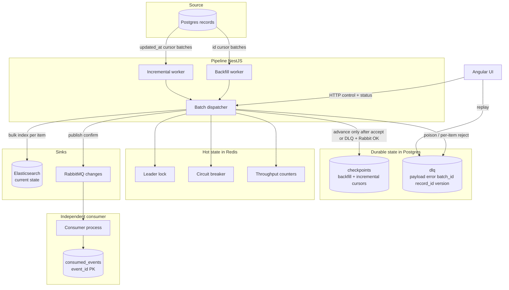

# Kill It Twice

Postgres → Elasticsearch + RabbitMQ replication with concurrent **backfill** and **incremental** sync. The design focus is failure behavior: crash recovery, sink outages, partial batch failure, and observability you can read without opening the code.

**Delivery guarantee: effectively-once** (at-least-once pipeline + idempotent sinks). Not exactly-once.

Also see [`SPEC.md`](SPEC.md) (contract + history) and [`AGENTS.md`](AGENTS.md) (repo conventions for agents/humans).

## Quick start (გაშვების ინსტრუქცია)

**Prerequisites**

- Docker Desktop (Linux containers)
- GNU Make, **or** Git Bash to run `./scripts/seed.sh` and `./verify.sh` directly
- ~4GB free RAM for Elasticsearch (512MB heap in compose)

```bash
docker compose up -d --build   # full stack
make seed                      # 1,000,000 rows (50k chunks)
make verify                    # G1–G5; kills pipeline and stops ES for real
```

Windows without `make`:

```bash
"C:/Program Files/Git/bin/bash.exe" ./scripts/seed.sh
"C:/Program Files/Git/bin/bash.exe" ./verify.sh
```

| Service | URL |
|---------|-----|
| UI | http://localhost:4200 |
| Pipeline API | http://localhost:3000 |
| Metrics | http://localhost:3000/metrics |
| RabbitMQ management | http://localhost:15672 — user `optio` / pass `optio` |
| Elasticsearch | http://localhost:9200 |
| Postgres | `localhost:5432` — user/db/pass `optio` |

## Architecture (არქიტექტურული დიაგრამა)

Components, data path, **where the checkpoint is written**, and **where the DLQ lives**:



**Data path (happy path):** Postgres → pipeline batch (≤500) → Elasticsearch `_bulk` + Rabbit confirm → Postgres `checkpoints` advance.

**Failure path (G4):** per-item ES reject → row stored in Postgres `dlq` with full context → cursor still advances → replay via `POST /api/dlq/:id/replay` or Control UI.

**Failure path (G3):** ES unreachable or incomplete bulk → Redis circuit opens → backoff sleep (1s→15s) → **checkpoint does not move** → resume when ES returns.

## Gate results (გეითების ცხრილი)

Final measured run (`make verify`, `SEED_COUNT=1000000`):

```
G1 resume after kill ............ PASS (killed at 405000 / resumed at 408500, checkpoint=408500, 0 lost)
G2 no duplicates ................ PASS (1000000 source / 1000000 sink / 0 dupes, effectively-once, deduped_redeliveries=333)
G3 sink outage .................. PASS (60s down, 0 lost, recovered in 23s, backoff_sleeps=9)
G4 partial batch failure ........ PASS (497 written, 3 in DLQ)
G5 observability ................ PASS
PASS=5 FAIL=0
```

| Gate | Result | Notes |
|------|--------|-------|
| G1 | **PASS** | `SIGKILL` mid-backfill; resume from Postgres checkpoint; final loss 0 |
| G2 | **PASS** | 1M source = 1M ES docs; distinct consumed record ids match; guarantee named in the log |
| G3 | **PASS** | ES stopped until ping failed; cursor_delta=0 during outage; ~9 backoff sleeps; recovered in 23s |
| G4 | **PASS** | 500-row side batch, 3 poison → 497 indexed, 3 open DLQ with replay context |
| G5 | **PASS** | `/api/status`, `/metrics`, UI shell answer position / throughput / lag / DLQ / health |

### Honest failure history (before the final green run)

`verify` is required to leave FAIL as FAIL. Earlier runs did fail; they were not hidden:

| Gate | Earlier result | Cause | Fix |
|------|----------------|-------|-----|
| G1 | FAIL | Docker `restart: unless-stopped` restarted the pipeline before the assert; status poll ≠ kill-time cursor | `restart: "no"`; assert against Postgres checkpoint **after** kill |
| G2 / G3 | FAIL (~24k ES docs missing) | During ES shutdown, some `_bulk` calls returned **0 item results without throwing**; checkpoint + Rabbit still advanced | Treat incomplete bulk as transport failure; do not advance |
| G3 | FAIL (cursor kept moving) | Timer started before ES ping actually failed | Wait until ES is unreachable, then measure the 60s window |

Final run: **PASS=5 FAIL=0**. No gate was weakened to force green.

## Delivery guarantee (მიწოდების გარანტია)

**Effectively-once.**

- Pipeline: **at-least-once** (crash before checkpoint → re-read the open batch).
- Elasticsearch: same `_id` never duplicates; older versions cannot overwrite newer ones (`version_type=external_gte`).
- Rabbit consumer: `INSERT … ON CONFLICT (event_id)` before ack; redeliveries increment `duplicate_hits` and are otherwise ignored.

We do **not** claim exactly-once across both sinks under all failure modes. The verify log line for G2 prints `effectively-once` explicitly.

## ADRs (მინ. 4)

Each ADR: **decision · alternatives · trade-offs (კომპრომისები)**.

### ADR-1 — Effectively-once, not exactly-once

- **Decision:** At-least-once delivery + idempotent sinks.
- **Alternatives:** Distributed transactions / 2PC; single-sink outbox only; marketing claim of “exactly-once”.
- **Trade-offs:** Occasional redelivery work (333 deduped redeliveries on the verify run) vs. avoiding a fragile cross-store transaction.

### ADR-2 — Postgres as the checkpoint and DLQ store

- **Decision:** Durable cursors and DLQ in Postgres; Redis only for leader lock, throughput, circuit.
- **Alternatives:** Redis-only checkpoints; Kafka offsets; filesystem journals.
- **Trade-offs:** Extra Postgres write per batch; survives Redis flush and `SIGKILL` without relying on graceful shutdown hooks.

### ADR-3 — Per-item bulk failure, not batch rollback

- **Decision:** On ES `_bulk`, keep successes, DLQ failures, advance cursor.
- **Alternatives:** Fail the whole batch and retry forever; drop poison silently.
- **Trade-offs:** Poison cannot block the pipeline; operators must replay from DLQ. Matches G4.

### ADR-4 — Bounded in-flight + exponential backoff

- **Decision:** Max 2 batches in flight per mode; on ES outage sleep 1s→15s with jitter; incomplete bulk responses count as transport failures.
- **Alternatives:** Unlimited concurrency; busy-loop retry; treat empty bulk as success.
- **Trade-offs:** Lower peak throughput under failure; no busy-loop. First verify lost ~24k docs when empty bulk was treated as success — fixed in SPEC v2.

## Capacity notes

Measured on Docker Desktop (single-node ES 512MB heap, batch 500, max 2 in flight):

| Metric | Value |
|--------|-------|
| Dataset | **1,000,000** rows |
| Peak observed throughput | ~3,500–7,500 records/s (status gauge; bursty) |
| Steady backfill during verify | ~2–4k records/s |
| Full verify wall time | ~7 minutes including 60s G3 outage |
| G3 recovery | 23s to resume progress after ES start |
| **Bottleneck** | Elasticsearch bulk indexing (and Rabbit confirms when backfill + incremental overlap) |

**What I would change to roughly double throughput:** raise ES heap / refresh settings, increase `MAX_IN_FLIGHT` with measured backpressure, or shard ES / partition pipeline workers by id range. Do not raise batch size blindly — G4’s contract is per-item handling inside the batch.

**Why 1M rows:** large enough that loading the table into memory is the wrong design and that crash/outage gates are meaningful; small enough that `make verify` finishes on a laptop. Seed inserts in **50k chunks** because a single 1M `generate_series` insert destabilized Docker Desktop on this host.

## რა არ ავაშენე და რატომ (What I did not build and why)

- **Apache NiFi / ClickHouse / S3** — listed in Optio’s broader stack, but not needed for the five gates; would dilute failure-mode focus.
- **Multi-node Elasticsearch / clustering** — local single-node is enough to prove sink outage and partial bulk.
- **Auth / multi-tenant control plane** — not required; would hide the pipeline under ceremony.
- **Polished product UI** — four functional screens only (status, records, control, simulate).
- **True cross-sink exactly-once** — dishonest for this topology; effectively-once is declared and tested.
- **NestJS shell for the consumer** — independent Node consumer with the same Postgres dedupe table; Nest framework on that process would not change gate behavior.

## სად გადაუხვია AI-მ სპეციფიკაციას (Where the AI diverged from the spec)

Minimum two concrete cases (three recorded):

### 1. Incremental watermark started at epoch (SPEC v1)

- **Assigned:** “Incremental cursor is `(updated_at, id)` greater than the watermark” with init at `1970-01-01`.
- **What went wrong:** The first implementation re-scanned the entire 1M table through Rabbit while backfill ran, flooded the consumer with duplicates, and starved useful progress.
- **Fix:** On first boot, if the checkpoint is still the epoch sentinel, set the watermark to `NOW()` so backfill owns history. Documented in SPEC v2.

### 2. Empty Elasticsearch bulk treated as success

- **Assigned:** Handle `_bulk` per-item; on transport error do not advance.
- **What went wrong:** During G3, while ES was shutting down, some bulk calls returned **zero item results without throwing**. The pipeline published to Rabbit and advanced the checkpoint anyway → first verify showed **24k missing ES docs**.
- **Fix:** Require `results.length == batch.length`; otherwise open the circuit and retry the batch. SPEC v2 §4.

### 3. Docker auto-restart masked G1

- **Assigned:** Kill the pipeline and prove resume from checkpoint.
- **What went wrong:** `restart: unless-stopped` brought the container back before the assert ran, so `resumed_from` no longer matched the kill-time status poll.
- **Fix:** `restart: "no"` for pipeline/consumer; G1 reads the Postgres checkpoint **after** kill as the source of truth.

## Spec history

1. `SPEC.md` v1 + `AGENTS.md` committed **before** application code.
2. Infra (compose, schema, seed).
3. Pipeline, consumer, UI, verify.
4. SPEC v2 after the verify failures above — not rewritten to look perfect after the fact.

## UI

| Route | Purpose |
|-------|---------|
| `/` | Health, backfill position, throughput, lag, DLQ, circuit |
| `/records` | Search replicated docs + live change feed |
| `/control` | Start/stop modes, settings, DLQ replay |
| `/simulate` | App-level sink down / poison / source changes (no Docker socket in the app) |

G1/G3 in `verify.sh` still stop real containers. UI simulate is for demos only.
