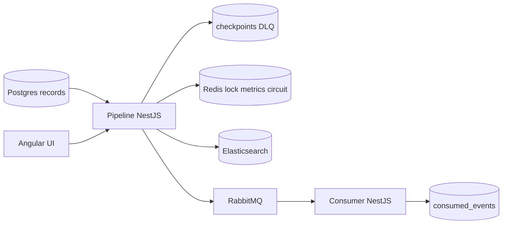

# Kill It Twice

Postgres → Elasticsearch + RabbitMQ replication with concurrent **backfill** and **incremental** sync. The design focus is failure behavior: crash recovery, sink outages, partial batch failure, and observability you can read without opening the code.

**Delivery guarantee: effectively-once** (at-least-once pipeline + idempotent sinks). Not exactly-once.

## Quick start

**Prerequisites:** Docker Desktop, GNU Make (or Git Bash + `./verify.sh`), ~4GB RAM free for Elasticsearch.

```bash
docker compose up -d --build
make seed          # 1,000,000 rows (chunked)
make verify        # G1–G5 PASS/FAIL (kills pipeline, stops ES)
```

On Windows without `make`, use Git Bash:

```bash
"C:/Program Files/Git/bin/bash.exe" ./scripts/seed.sh
"C:/Program Files/Git/bin/bash.exe" ./verify.sh
```

| Service | URL |
|---------|-----|
| UI | http://localhost:4200 |
| Pipeline API | http://localhost:3000 |
| Metrics | http://localhost:3000/metrics |
| RabbitMQ management | http://localhost:15672 (optio/optio) |
| Elasticsearch | http://localhost:9200 |

## Architecture



- **Checkpoint** lives in Postgres. It advances only after every record in a batch is accepted by Elasticsearch or written to `dlq`, and Rabbit confirms succeed.
- **DLQ** stores full payload + error + batch id + record id + version for replay.
- **Backfill** cursor: `id > cursor ORDER BY id`.
- **Incremental** cursor: `(updated_at, id) > watermark`. On first boot the watermark is set to `NOW()` so history is owned by backfill.
- **Search idempotency:** `_id = record id`, `version_type=external_gte`.
- **Event idempotency:** `event_id = recordId:version` primary key in `consumed_events`.

## Gate results (measured)

```
G1 resume after kill ............ PASS (killed at 405000 / resumed at 408500, checkpoint=408500, 0 lost)
G2 no duplicates ................ PASS (1000000 source / 1000000 sink / 0 dupes, effectively-once, deduped_redeliveries=333)
G3 sink outage .................. PASS (60s down, 0 lost, recovered in 23s, backoff_sleeps=9)
G4 partial batch failure ........ PASS (497 written, 3 in DLQ)
G5 observability ................ PASS
PASS=5 FAIL=0
```

| Gate | Result | Notes |
|------|--------|-------|
| G1 | PASS | `SIGKILL` mid-backfill; resume from Postgres checkpoint; final loss 0 |
| G2 | PASS | 1M source = 1M ES docs; distinct consumed record ids match; guarantee named in the log line |
| G3 | PASS | ES stopped until ping failed; cursor did not advance during outage; ~9 backoff sleeps; recovered in 23s |
| G4 | PASS | 500-row side batch, 3 poison → 497 indexed, 3 open DLQ with replay context |
| G5 | PASS | `/api/status`, `/metrics`, UI shell answer position / throughput / lag / DLQ / health |

## Delivery guarantee

**Effectively-once.**

- Pipeline: at-least-once (crash before checkpoint → re-read batch).
- Elasticsearch: same `_id` never duplicates; older versions cannot overwrite newer ones (`external_gte`).
- Rabbit consumer: `INSERT … ON CONFLICT (event_id)` before ack; redeliveries are counted in `duplicate_hits` and ignored.

We do **not** claim exactly-once across both sinks under all failure modes.

## ADRs

### ADR-1 — Effectively-once, not exactly-once

- **Decision:** At-least-once + idempotent sinks.
- **Alternatives:** Distributed transactions / 2PC; outbox + single sink; claim “exactly-once” in marketing copy.
- **Tradeoff:** Occasional redelivery work (measured 333 deduped redeliveries on the verify run) vs. avoiding a fragile cross-store transaction.

### ADR-2 — Postgres as the checkpoint store

- **Decision:** Durable cursors and DLQ in Postgres; Redis only for leader lock, throughput, circuit.
- **Alternatives:** Redis-only checkpoints; Kafka offsets; filesystem.
- **Tradeoff:** Extra Postgres write per batch; survives Redis flush and `SIGKILL` without depending on graceful shutdown.

### ADR-3 — Per-item bulk failure, not batch rollback

- **Decision:** On ES `_bulk`, keep successes, DLQ failures, advance cursor.
- **Alternatives:** Fail the whole batch and retry forever; drop poison silently.
- **Tradeoff:** Poison cannot block the pipeline; operators replay from DLQ. Matches G4.

### ADR-4 — Bounded in-flight + exponential backoff

- **Decision:** Max 2 batches in flight per mode; on ES outage sleep 1s→15s with jitter; incomplete bulk responses count as transport failures.
- **Alternatives:** Unlimited concurrency; busy-loop retry; treat empty bulk as success.
- **Tradeoff:** Lower peak throughput under failure; no busy-loop; first verify lost ~24k docs when empty bulk was treated as success — fixed in SPEC v2.

## Capacity notes

Measured on Docker Desktop (single-node ES 512MB heap, batch 500, max 2 in flight):

| Metric | Value |
|--------|-------|
| Dataset | 1,000,000 rows |
| Peak observed throughput | ~3,500–7,500 records/s (status gauge; bursty) |
| Steady backfill (verify) | order of ~2–4k records/s |
| Full verify wall time | ~7 minutes including 60s G3 outage |
| G3 recovery | 23s to resume progress after ES start |
| Bottleneck | Elasticsearch bulk indexing (and Rabbit confirms when both modes overlap) |

**To roughly double throughput:** raise ES heap and refresh interval further, increase `MAX_IN_FLIGHT` with measured backpressure, or shard ES / run pipeline workers per id range. Do not raise batch size blindly — G4’s contract is per-item handling inside the batch.

**Dataset choice:** 1M is large enough that in-memory load is the wrong design and small enough that verify finishes locally. Seed runs in 50k chunks because a single 1M insert destabilized Docker Desktop on this host.

## What I did not build (and why)

- **Apache NiFi / ClickHouse / S3** — out of scope for the five gates; would dilute failure-mode focus.
- **Multi-node Elasticsearch / clustering** — local single-node is enough to prove sink outage and partial bulk.
- **Auth / multi-tenant control plane** — not required; would hide the pipeline under ceremony.
- **Polished product UI** — four functional screens only (status, records, control, simulate).
- **True cross-sink exactly-once** — dishonest for this topology; effectively-once is declared and tested.

## Where the AI diverged from the spec

### 1. Incremental watermark started at epoch (SPEC v1)

- **Assigned:** “Incremental cursor is `(updated_at, id)` greater than the watermark” with init at `1970-01-01`.
- **What went wrong:** The first implementation re-scanned the entire 1M table through Rabbit while backfill ran, flooded the consumer with duplicates, and starved useful progress.
- **Fix:** On first boot, if the checkpoint is still the epoch sentinel, set the watermark to `NOW()` so backfill owns history. Documented in SPEC v2.

### 2. Empty Elasticsearch bulk treated as success

- **Assigned:** Handle `_bulk` per-item; on transport error do not advance.
- **What went wrong:** During G3, while ES was shutting down, some bulk calls returned **zero item results without throwing**. The pipeline published to Rabbit and advanced the checkpoint anyway → first verify showed **24k missing ES docs**.
- **Fix:** Require `results.length == batch.length`; otherwise open the circuit and retry the batch. SPEC v2 §4.

### 3. (Supporting) Docker auto-restart masked G1

- **Assigned:** Kill the pipeline and prove resume from checkpoint.
- **What went wrong:** `restart: unless-stopped` brought the container back before the assert ran, so `resumed_from` no longer matched the kill-time status poll.
- **Fix:** `restart: "no"` for pipeline/consumer; G1 reads the Postgres checkpoint **after** kill as the source of truth.

## Spec history

1. `SPEC.md` v1 + `AGENTS.md` committed **before** application code.
2. Infra (compose, schema, seed).
3. Pipeline, consumer, UI, verify.
4. SPEC v2 after the verify failures above — not rewritten to look perfect after the fact.

See `SPEC.md` and `AGENTS.md`.

## UI

| Route | Purpose |
|-------|---------|
| `/` | Health, backfill position, throughput, lag, DLQ, circuit |
| `/records` | Search replicated docs + live change feed |
| `/control` | Start/stop modes, settings, DLQ replay |
| `/simulate` | App-level sink down / poison / source changes (no Docker socket in the app) |

G1/G3 in `verify.sh` still stop real containers.
